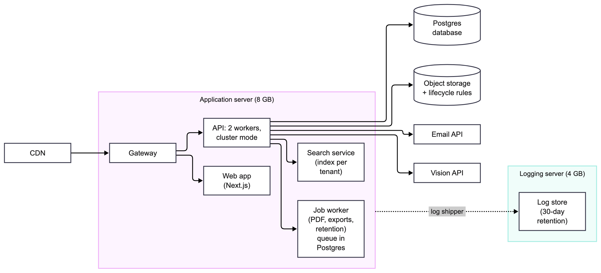
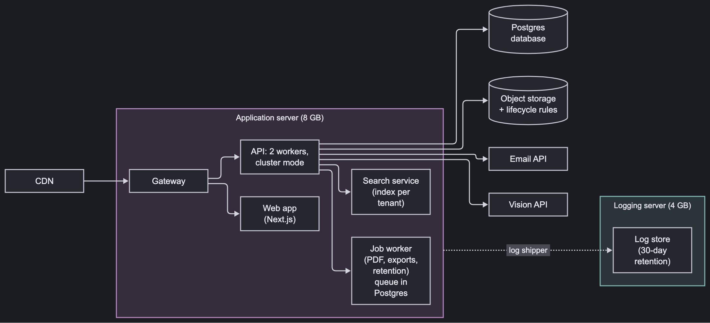
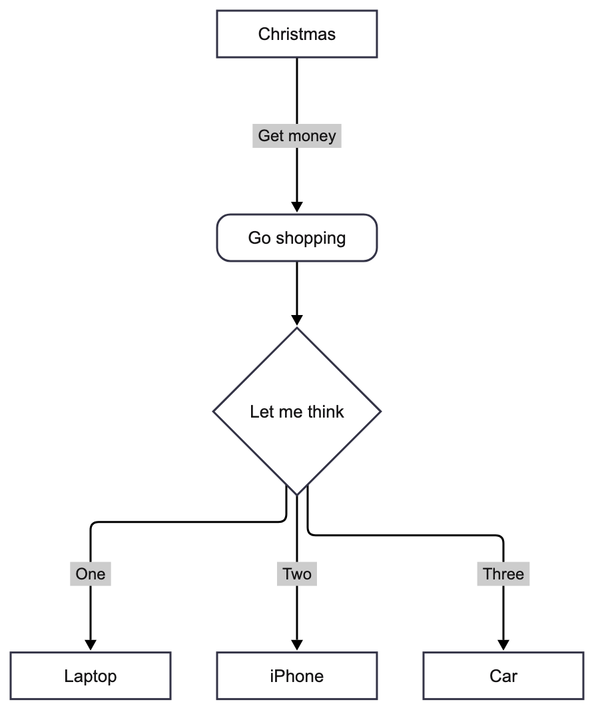

# mermaid_flowchart

[](https://pub.dev/packages/mermaid_flowchart)
[](https://github.com/felipeminello/mermaid_flowchart/actions/workflows/ci.yaml)
[](LICENSE)

Render [Mermaid](https://mermaid.js.org/syntax/flowchart.html) flowcharts
natively in Flutter: no WebView, no JavaScript, on every platform.



## Features

- **Subgraphs that behave**: nested subgraphs, nodes declared outside and
  used inside, and edges to or from a whole subgraph (`APP --> LOGS`).
  Members stay inside their box and everything else stays out.
- **Every classic node shape**: rectangle, rounded, stadium, subroutine,
  cylinder, circle, double circle, asymmetric, rhombus, hexagon,
  parallelograms and trapezoids, plus Mermaid 11's `A@{ shape: cyl }`.
- **Every link style**: `-->`, `---`, `-.->`, `==>`, `~~~`, `<-->`, `--o`,
  `--x`, longer links (`--->`), labels in pipes (`-->|text|`) or inline
  (`-- text -->`), and `&` chaining (`A & B --> C`).
- **Readable labels**: quoted text, `<br/>` line breaks, Markdown strings,
  entities (`#quot;`, `&amp;`) and automatic wrapping.
- **Clean orthogonal edges**: long edges run in straight lanes, bends are
  rounded, and parallel segments are spread over tracks to avoid crossings.
- **Styling**: `classDef`, `class`, `:::`, `style` and `linkStyle`.
- **Light and dark palettes** that follow your `Theme`, fully customizable.
- **Interactive**: `onNodeTap` reports the tapped node.
- **Pure Dart layout** you can also use on its own to draw on any canvas.

| Dark palette | Top-down |
| --- | --- |
|  |  |

## Getting started

```sh
flutter pub add mermaid_flowchart
```

## Usage

```dart
import 'package:mermaid_flowchart/mermaid_flowchart.dart';

MermaidFlowchart(
  source: '''
flowchart LR
  A[Start] --> B{Is it working?}
  B -->|Yes| C[Ship it]
  B -->|No| D[Debug] --> B
''',
  errorBuilder: (context) => const Text('Not a flowchart'),
  onNodeTap: (node) => debugPrint('Tapped ${node.id}'),
)
```

The diagram is drawn at its natural size, which depends on its content.
To fit it in the available width, or to pan and zoom:

```dart
FittedBox(
  fit: BoxFit.scaleDown,
  alignment: Alignment.topLeft,
  child: MermaidFlowchart(source: source),
)

InteractiveViewer(
  constrained: false,
  child: MermaidFlowchart(source: source),
)
```

### Theming

Colors follow the ambient `Theme` brightness. Pass your own palette, text
styles or spacing to change them:

```dart
MermaidFlowchart(
  source: source,
  palette: const FlowchartPalette.dark(),
  textStyles: FlowchartTextStyles.from(
    const TextStyle(fontFamily: 'Inter'),
    nodeFontSize: 14,
    nodeWrapWidth: 160,
  ),
  layoutConfig: const FlowLayoutConfig(nodeSeparation: 50),
)
```

`style`, `classDef` and `linkStyle` statements in the diagram still win over
the palette for the elements they target.

### In Markdown

With [`flutter_markdown`](https://pub.dev/packages/flutter_markdown) or
[`flutter_markdown_plus`](https://pub.dev/packages/flutter_markdown_plus),
render ```` ```mermaid ```` blocks with a custom builder:

```dart
class MermaidBuilder extends MarkdownElementBuilder {
  @override
  Widget? visitElementAfterWithContext(
    BuildContext context,
    md.Element element,
    TextStyle? preferredStyle,
    TextStyle? parentStyle,
  ) {
    final source = element.textContent;
    if (element.attributes['class'] != 'language-mermaid' ||
        !FlowchartParser.isFlowchart(source)) {
      return null; // Keep the default code block.
    }
    return FittedBox(
      fit: BoxFit.scaleDown,
      alignment: Alignment.topLeft,
      child: MermaidFlowchart(source: source),
    );
  }
}

MarkdownBody(data: markdown, builders: {'code': MermaidBuilder()});
```

### Lower-level API

Each stage is exported, so you can parse, lay out and paint separately:

```dart
final chart = const FlowchartParser().parse(source); // null if not a flowchart
final styles = FlowchartTextStyles.from(const TextStyle());
final layout = FlowchartLayout.compute(chart!, styles.measure);

layout.nodeRects; // where every node is
layout.clusters; // subgraph boxes
layout.edges; // orthogonal polylines and label positions

CustomPaint(
  size: layout.size,
  painter: FlowchartPainter(
    chart: chart,
    layout: layout,
    styles: styles,
    palette: const FlowchartPalette.light(),
  ),
);
```

## Supported syntax

| Feature | Syntax |
| --- | --- |
| Header and direction | `flowchart`, `graph`, with `TB`, `TD`, `BT`, `LR`, `RL` |
| Node shapes | `[ ]`, `( )`, `([ ])`, `[[ ]]`, `[( )]`, `(( ))`, `((( )))`, `> ]`, `{ }`, `{{ }}`, `[/ /]`, `[\ \]`, `[/ \]`, `[\ /]`, `@{ shape: ... }` |
| Links | `-->`, `---`, `-.->`, `-.-`, `==>`, `===`, `~~~`, `<-->`, `--o`, `--x`, longer variants |
| Link labels | `-->\|text\|`, `-- text -->`, `-. text .->`, `== text ==>` |
| Chaining | `A --> B --> C`, `A & B --> C & D` |
| Subgraphs | `subgraph id [Title]`, nesting, subgraphs as edge endpoints |
| Labels | `"quoted"`, `<br/>`, `` "`Markdown`" ``, `#quot;` and HTML entities |
| Styling | `classDef`, `class`, `:::`, `style`, `linkStyle` |
| Misc | `%%` comments, `;` separators, front matter |

Not supported yet: `direction` inside a subgraph (the chart's direction is
used), `click` callbacks (use `onNodeTap`), icons, images, and the ELK
layout. Unknown statements are skipped rather than failing the whole chart.

## How the layout works

A layered (Sugiyama-style) layout in the spirit of Mermaid's dagre:

1. **Ranks** come from a longest-path layering. Subgraphs stay contiguous:
   an edge leaving a subgraph places its target after the whole subgraph.
2. **Long edges** get one dummy node per crossed rank, reserving a straight
   lane. Labelled edges span at least two ranks so the label gets its own
   lane.
3. **Subgraphs** are laid out innermost first and then moved as rigid
   blocks, so members stay together and non-members stay out.
4. **Order and position**: barycenter sweeps order each rank, then
   positions are solved with weighted-median isotonic regression, which
   keeps lanes straight and lets blocked nodes give way.
5. **Routing**: edges are orthogonal; vertical segments are assigned to
   per-gap tracks ordered to avoid crossings.

## Example app

[`example/`](example/) is a live editor: type Mermaid on one side and see it
rendered on the other, with sample diagrams and a dark mode toggle.

```sh
cd example
flutter create .   # generate the platform folders once
flutter run
```

## Contributing

Issues and pull requests are welcome. Run `dart format .`,
`flutter analyze` and `flutter test` before sending a change. The
screenshots in `doc/` are regenerated with
`flutter test tool/screenshots_test.dart`.

## License

[MIT](LICENSE)
